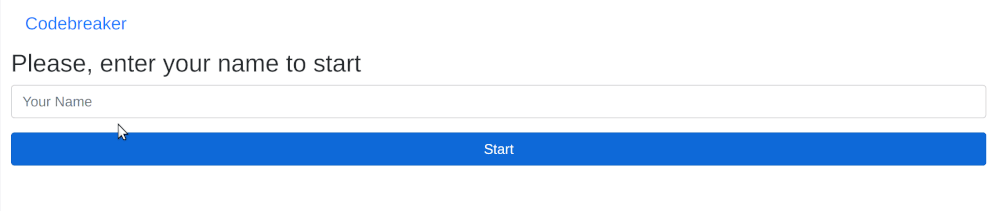
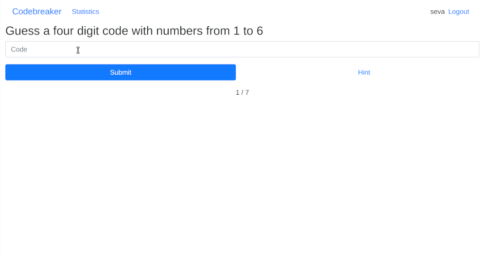
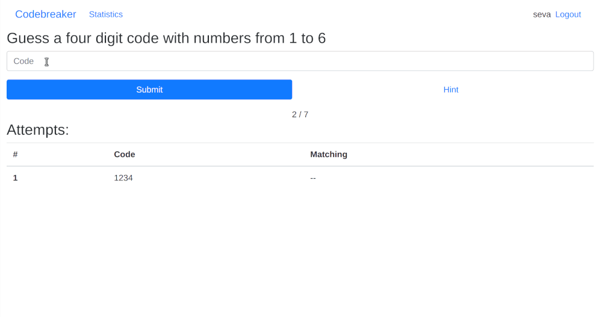
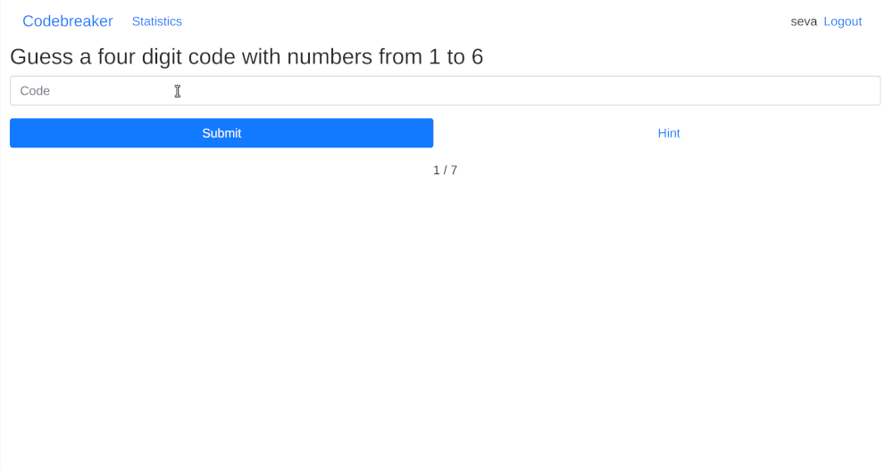
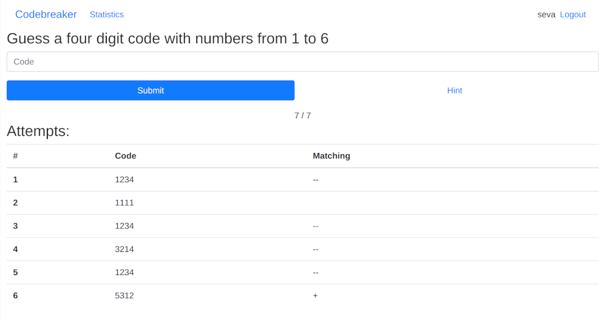
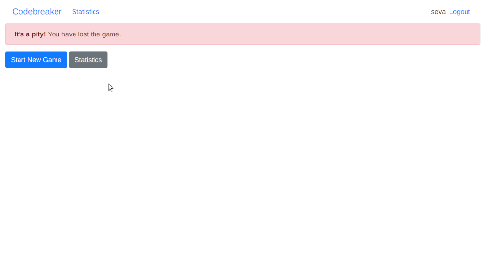
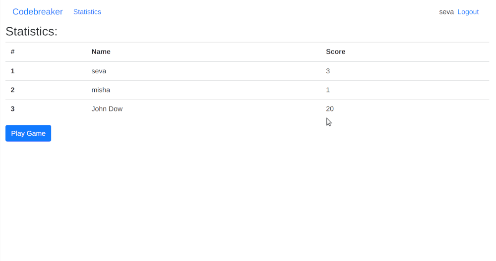

# CodebreakerRack

This is a rack app for [Codebreaker](https://github.com/Sevavietl/RubyGarageCodebreaker)

## Usage

1. You have to login to be able to play.

2. Take a guess

**Be sure** you provide valid code

3. You can win.

4. You can loose.

5. You can browse scores statistics.

6. You can logout and use different name.

## License

The gem is available as open source under the terms of the [MIT License](https://opensource.org/licenses/MIT).
